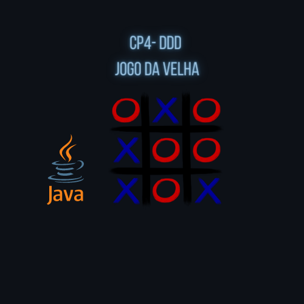

<h1 align="center">
    
</h1>
<h4 align="center"> 
	🚧 🚀 Em construção... 🚧
</h4>

  
  
  
  
  

Objetivos
	
• Trabalhar com os conceitos de Classes, Atributos, Métodos, Objetos, Construtores,
Condicionais e Repetições, Polimorfismo, Arrays (Vetor e Matriz) e Exceções;
	
Descrição
	
O Jogo da Velha é um jogo de regras extremamente simples, que não traz
grandes dificuldades para seus jogadores e é facilmente aprendido. Seu nome teria se
originado na Inglaterra, quando nos finais da tarde, mulheres se reuniram para conversar
e bordar.
	
As mulheres idosas, por não terem mais condições de bordar em razão da
fraqueza da visão, jogavam este jogo simples, que passou a ser conhecido como o da
“velha". Porém, sua origem teria sido ainda mais antiga. Fala-se em tabuleiros escavados
na rocha de templos do antigo Egito, que teriam sido feitos por escravos há 3.500 anos.
	
Regras
	
● O tabuleiro é uma matriz de três linhas por três colunas.
	
● Dois jogadores escolhem uma marcação cada um, geralmente um círculo (O) e um
xis (X).
	
● Os jogadores jogam com as mãos uma marcação por vez em uma coluna que esteja
vazia.
	
● Quando um jogador conquista o objetivo, costuma-se riscar os três símbolos.
	
● Quando um dos jogadores vence, o programa dá a possibilidade do jogo recomeçar
	
● Se o jogo foi iniciado por um jogador e houve empate, então o jogo deve ser iniciado
pelo outro jogador.
	
Se os dois jogadores jogarem sempre da melhor forma, o jogo terminará sempre
em empate. A lógica do jogo é muito simples, de modo que não é difícil deduzir ou decorar
todas as possibilidades para efetuar a melhor jogada - apesar de o número total de
possibilidades ser muito grande, a maioria delas é simétrica, além de que as regras são
simples. Por esse motivo, é muito comum que o jogo empate (ou "dê velha").

